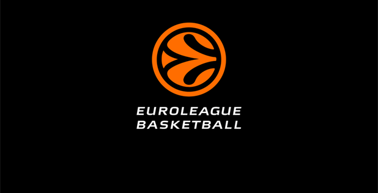
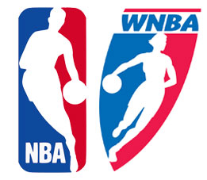

En el baloncesto se disputan numeroso torneos que son iguales tanto en la categoría masculina como en la femenina. A continuación os los muestro, diferenciando entre competiciones nacionales e internacionales:

## Clubes

Las competiciones más importantes a nivel de clubes, tanto hombres como mujeres, son las siguientes:

#### - Liga

A nivel de clubes podemos destacar la Liga ENDESA tanto en hombre como mujeres. Se juega una liga regular entre los 20 equipos y posteriormente juegan unos Playoff entre los 8 mejores de la siguiente manera:
* Primero vs octavo
* Segundo vs séptimo
* Tercero vs sexto
* Cuarto vs quinto
Dependiendo del año y de la ronda, se juegan más o menos partidos en cada ronda. Cada partido se juega en el pabellón de uno de los equipos, jugando un partido más en el pabellón del equipo que tenga una mejor clasificación en la liga regular.

Aquí tenéis los enlaces para acceder a la web oficial de ambas competiciones:

[ACB](https://www.acb.com/)

[LIGA FEMENINA ENDESA](http://www.lfendesa.es/inicio.aspx)

#### - Copa

A mitad de la temporada, los **8 mejores equipos** de la competición jugarán eliminatorias **a partido único** y se jugarán todos los partidos en una misma ciudad y en un mismo campo.
El sorteo será entre los cuatro primero, que jugarán con los equipos entre el quinto y octavo puesto.
La denominación es diferente en función de la categoría:

* Copa del Rey en hombres.
* Copa de la Reina en mujeres.

#### - Euroliga

Es la competición más importante a nivel internacional, en la que participan un determinado conjunto de equipos que pertenecen a la asociación, independientemente de su clasificación en las ligas nacionales.

* Se juega una pequeña **liga regular** en la que juegan 2 partidos contra todos los equipos, uno en cada pabellón.
* Los **8 mejores** equipos juegan unos **Playoff** y los ganadores se clasifican para la Final Four.
* En un pabellón establecido al principio de la competición jugarán la **Final Four**, dividido en 2 semifinales y la final.

En estos enlaces podréis acceder a la web oficial de las dos competiciones:

[Euroliga femenina](http://www.fiba.basketball/euroleaguewomen/20-21)

[Euroliga masculina](https://www.euroleague.net/)

## Selecciones

A nivel de selecciones se juegan 3 competiciones periódicamente bajo la organización de la FIBA, la federación internacional de baloncesto. Serán los mismos en mujeres y hombres. Las competiciones son las siguientes:
* Europeo.
* Mundial.
* Juegos Olímpicos.

Las selecciones que se clasificarán a los mundiales y Juegos Olímpicos serán los mejores en el Europeo.

En en siguiente enlace, de la FIBA, podéis encontrar toda la información que os interes sobre estas dos competiciones:

[FIBA](http://www.fiba.basketball/es)

## NBA Y WNBA

Estas son las ligas que se juegan en Estados Unidos. Tanto en la competición femenina como en la masculina, solo se juega una competición. El formato es igual que la liga de nuestro país, dividiendo la competición en dos fases:
* **Fase regular:** todos los equipos juegan un número determinado de partidos (suelen ser 82), y los mejores clasificados pasan a los Playoffs.
* **Playoff:** hay 2 conferencias y unos playoff en cada una de ellas (la organización es la misma que has leído anteriormente en la Liga Endesa). Los mejores de cada conferencia jugarán la final.

[NBA](https://es.nba.com/)

[WNBA](https://www.wnba.com/)

